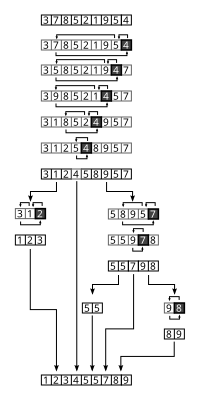

# Sorting Algorithms and Big-O Notation

## Objectives
- understand some basic sorting algorithms
- understand and evaluate "time complexity"
- how to select the most appropriate sorting algorithm
- what is a stable sorting algorithm

## Guidelines
- no more than five functions per file
- the standard library is not allowed unless otherwise specified :angry:
- `main.c` will not be compiled by the checker
- include all function prototypes in `sort.h`
- header files should be include-guarded
- list and arrays **do not need to be sorted** if their length is less than 2

### Provided Code
be sure to include the prototypes of the provided functions and `struct`s in `sort.h`

#### Functions
in `print_array.c` : 
```c
#include <stdlib.h>
#include <stdio.h>

/**
 * print_array - Prints an array of integers
 *
 * @array: The array to be printed
 * @size: Number of elements in @array
 */
void print_array(const int *array, size_t size)
{
    size_t i;

    i = 0;
    while (array && i < size)
    {
        if (i > 0)
            printf(", ");
        printf("%d", array[i]);
        ++i;
    }
    printf("\n");
}
```

in `print_list.c` :
```c
#include <stdio.h>
#include "sort.h"

/**
 * print_list - Prints a list of integers
 *
 * @list: The list to be printed
 */
void print_list(const listint_t *list)
{
    int i;

    i = 0;
    while (list)
    {
        if (i > 0)
            printf(", ");
        printf("%d", list->n);
        ++i;
        list = list->next;
    }
    printf("\n");
}
```

#### Data Structures
in `sort.h` :
```c
/**
 * struct listint_s - Doubly linked list node
 *
 * @n: Integer stored in the node
 * @prev: Pointer to the previous element of the list
 * @next: Pointer to the next element of the list
 */
typedef struct listint_s
{
    const int n;
    struct listint_s *prev;
    struct listint_s *next;
} listint_t;
```

----
## Sorting Algorithm Visualizations
source : <https://en.wikipedia.org>
### Bubble Sort


### Insertion Sort

### Selection Sort

### Quick Sort




<!--

### Advanced
- Shell Sort
- Cocktail Shaker Sort
- Counting Sort
- Merge Sort
- Heap Sort
- Radix Sort
- Bitonic Sort
- Quick Sort - Hoare Partition Scheme

-->

----

## Big-O Notation Explanation
source : <https://stackoverflow.com/questions/487258/what-is-a-plain-english-explanation-of-big-o-notation>


big-o reduces the comparison between algorithms to a single variable and is concerned with *how* cost scale

how does the cost function behave as $n$ goes to infinity ?

"complexity" here typically denotes the amount of calculations performed per unit of input. it would be more accurate to call this a performance or resource "cost".

big-o notation is only concerned with worst-case scenarios rather then the common-case or the best-case scenarios.

when considering the cost-scaling calculations of a program's input, it is **only the most-significant term that matters**. that is, if our calculations turn out to be $n^3+4n^2+1232n+433$, then the term $n^3$ is what will dominate the cost

### Telephone Book (Example)
given a divide-and-conquer algorithm such as binary search, it's calculation cost comes down to $O(\log n)$. the actual base of the log is irrelevant in much the same way that $O(332n)$ and $O(\frac{1}{2} n)$ are considered the same as $O(n)$.

### Traveling Salesman
this longstanding problem in computation theory ask what is the shortest tour that visits every town in a given map ? that is how do we find such a path ? in other words what is the most efficient algorithm -- the one with the lowest computation cost ? 

from a straightforward analysis, given a set of n towns will result in total of n! possible tours. thus, in the worst-case analysis we are dealing with $O(n!)$ computational cost

### Polynomial Time
any algorithm with a cost of the form $O(n^c)$ (where $c$ is some constant) is said to be solvable in polynomial time. a question that theoraticians like to entertain themselves with is, whether or not for a given computational problem does there exist an algorithm that can solve it in polynomial time ? in practice, many widely-used algorithms are *not* polynomial time ($\Xi$. public-key cryptography)
